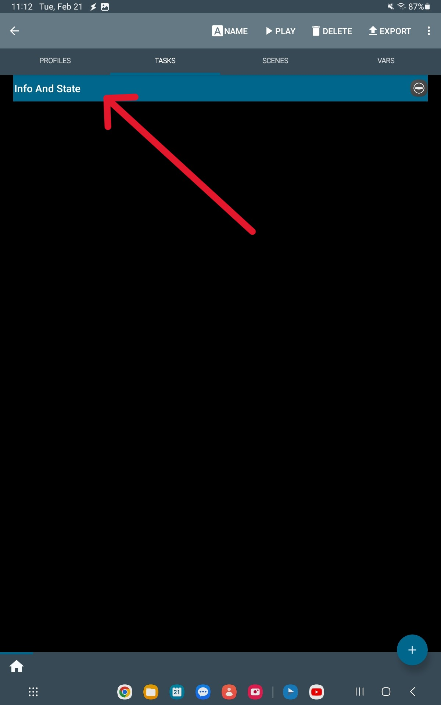
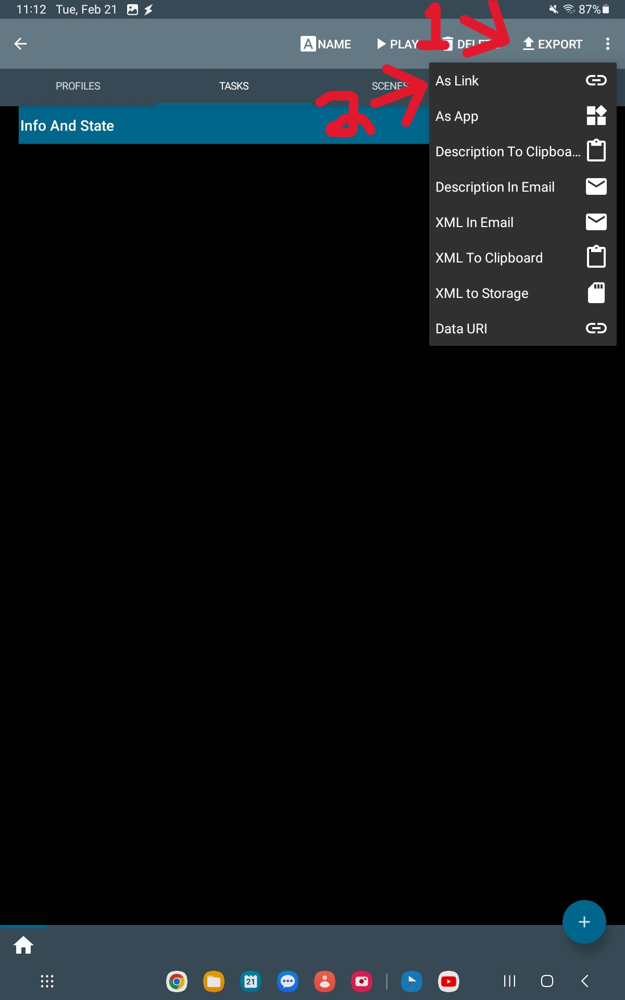

In the **Tasker App**

1. Go to the Tasks Tab at the top

    

2. Hold down the Task you want to share

    

3. Press on "Export" at the top right and Press on "As Link"

    

5. Add *Tags as required*, and **Optionally** add a description, or make it Public on [Taskernet](https://taskernet.com/) where you can view other Tasker Shares

    

6. Press the back arrow and your done! Here is my Tasker Share for [Info and State](https://taskernet.com/shares/?user=AS35m8kajU17RlSqYXioAiOHtz3ZH5t63ZQqxoCjEdiCgDA2BoPfS9yYJ9gHtpObgWBbv9I%3D&id=Task%3AInfo+And+State)

*Bug that I noticed:
Sometimes when you run the commands the Tasker app won't go to the next step in sequence, in this case you should relaunch the HTTP Request Shortcuts app and try again.*